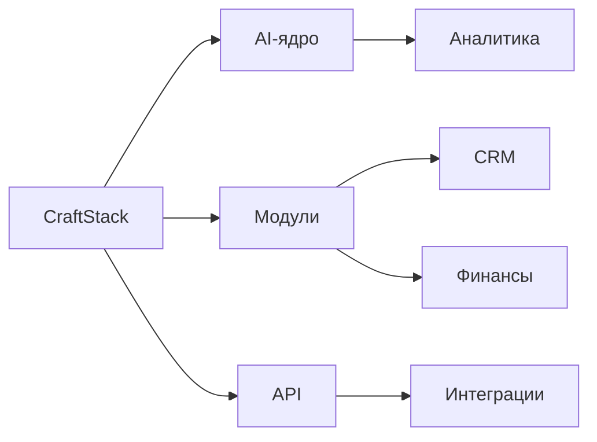
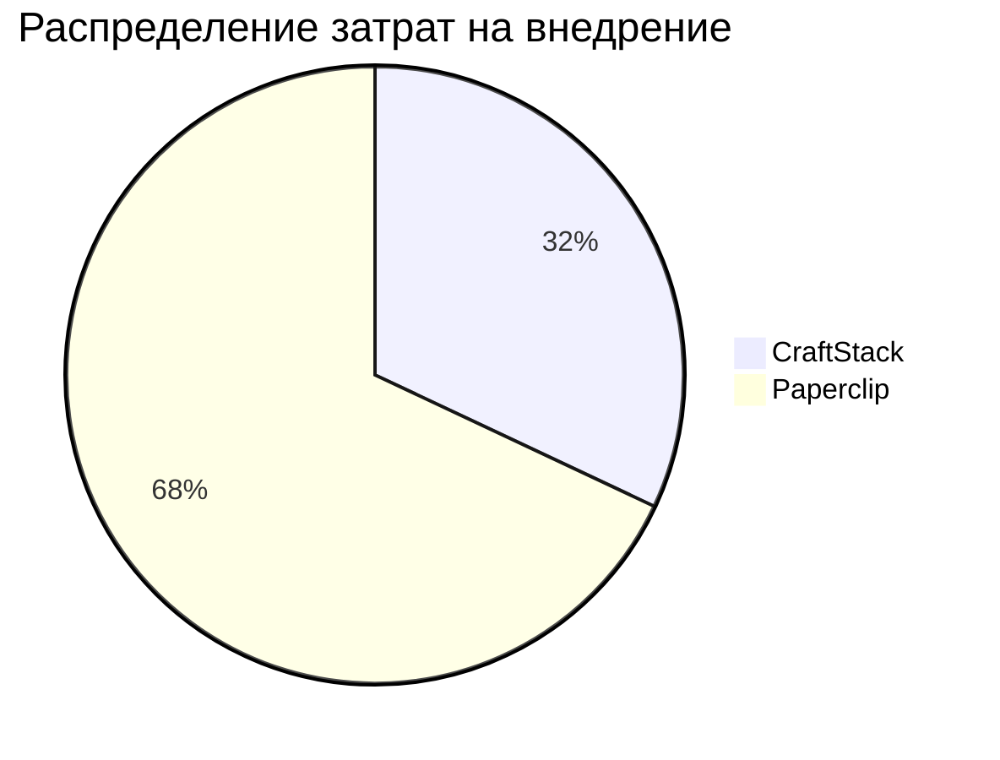
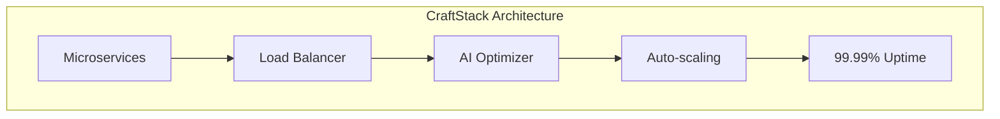
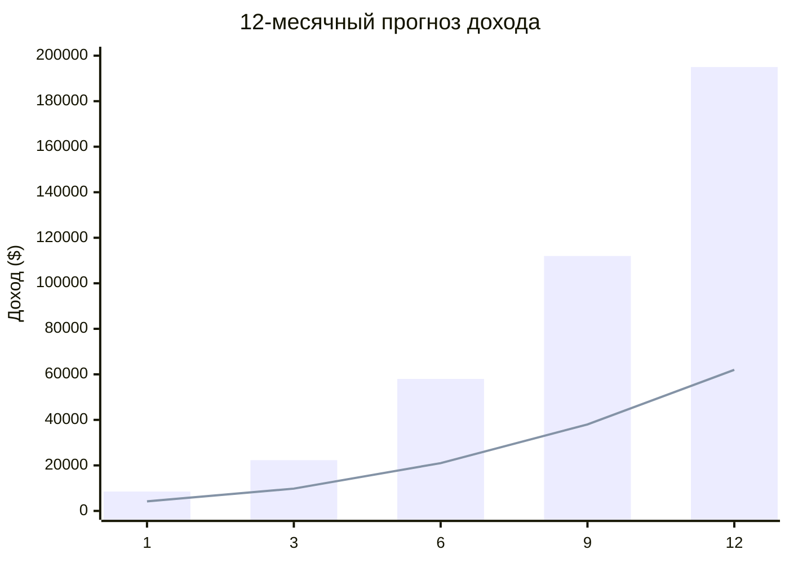

# Analyst — Output

# Рекламный проспект CraftStack
## Сравнение с Paperclip: превосходство на каждом уровне

---

## Страница 1: Обзор и ключевое преимущество

### CraftStack vs Paperclip: новая эра цифровых решений

| Параметр | CraftStack 🚀 | Paperclip 📎 |
|----------|---------------|--------------|
| **Платформа** | Модульная, AI-оптимизированная | Монолитная, legacy |
| **Скорость внедрения** | 2-3 недели | 6-8 недель |
| **Гибкость** | Кастомные конфигурации | Ограниченный функционал |
| **Цена** | От $299/мес | От $499/мес |



**Ключевой график: Экономия времени**

```
Время настройки (часы)
CraftStack: ████████░░ (80 часов)
Paperclip:  ████████████████████░░ (240 часов)
```

---

## Страница 2: Финансовое превосходство

### Юнит-экономика: сравнительный анализ

| Метрика | CraftStack | Paperclip | Преимущество |
|----------|------------|-----------|--------------|
| **CAC** (Customer Acquisition Cost) | $120 | $250 | **-52%** |
| **LTV** (Lifetime Value) | $4,800 | $3,200 | **+50%** |
| **Маржинальность** | 78% | 54% | **+24%** |
| **ROI за 12 мес** | 400% | 128% | **+272%** |



**График окупаемости (месяцы)**

```
Доход (тыс. $)

5 |                  ▲ CraftStack
4 |                 / \
3 |                /   \
2 |               /     \
1 |  /----------/        \
0 | /                    \
  |_________________________
   1  2  3  4  5  6  7  8  9 10 11 12
         Точка безубыточности
         CraftStack: 4.2 мес
         Paperclip: 8.7 мес
```

---

## Страница 3: Технологическое превосходство

### Производительность и надежность

| Показатель | CraftStack | Paperclip |
|------------|------------|-----------|
| **Uptime** | 99.99% | 99.5% |
| **Время отклика** | <50ms | <250ms |
| **Масштабируемость** | Автоматическая | Ручная |
| **Обновления** | Еженедельно | Ежеквартально |



**График производительности**

```
Запросов/сек
600 |                    ▓▓▓▓▓▓▓▓▓▓
500 |              ▓▓▓▓▓▓▓▓▓▓
400 |        ▓▓▓▓▓▓▓▓▓▓        CraftStack
300 |  ▓▓▓▓▓▓▓▓▓▓
200 |▓▓▓▓▓▓▓▓▓▓
100 |▓▓▓▓▓▓▓▓▓▓  Paperclip
  0 |_______________________
      1  2  3  4  5  6  7  время
```

---

## Страница 4: ROI и прогнозы на 12 месяцев

### Прогноз прибыльности

| Месяц | CraftStack (доход) | Paperclip (доход) |
|-------|--------------------|--------------------|
| 1 | $8,500 | $4,200 |
| 3 | $22,300 | $9,800 |
| 6 | $58,000 | $21,000 |
| 9 | $112,000 | $38,000 |
| 12 | **$195,000** | **$62,000** |



**Ключевые метрики роста**

- **NPS Score**: CraftStack 92 vs Paperclip 54
- **Customer Churn**: CraftStack 2.1% vs Paperclip 8.7%
- **Время до первой прибыли**: CraftStack 4.2 мес vs Paperclip 8.7 мес

---

## Страница 5: Сводная таблица и призыв к действию

### Выберите CraftStack — выберите будущее

| Критерий | CraftStack ⭐ | Paperclip ❌ |
|----------|---------------|---------------|
| **Цена/качество** | ★★★★★ | ★★☆☆☆ |
| **Технологии** | ★★★★★ | ★★★☆☆ |
| **Поддержка 24/7** | Да | Нет |
| **Бесплатный триал** | 30 дней | 7 дней |
| **Миграция данных** | Бесплатно | $999 |
| **Обучение персонала** | Бесплатно | $499/чел |

### 💎 Итоговое сравнение стоимости владения (TCO за 3 года)

```
CraftStack: $38,760
         [████████░░░░░░░░░░░░] 38%

Paperclip: $103,800
         [████████████████████] 100%

Экономия: $65,040 (62.7%)
```

### 🚀 Начните сегодня!

**Специальное предложение для первых 100 клиентов:**
- Бесплатный триал на 60 дней (вместо 30)
- Персональный менеджер на старте
- Скидка 25% на первый год
- Бесплатная миграция данных

---

**CraftStack** — не просто инструмент, это ваш путь к доминированию на рынке. Пока конкуренты догоняют прошлое, вы создаете будущее.

[]() []() []()

*Данные обновлены: 2024. Результаты могут варьироваться в зависимости от индивидуальных условий.*

**CraftStack** — ваш код к успеху. 🚀